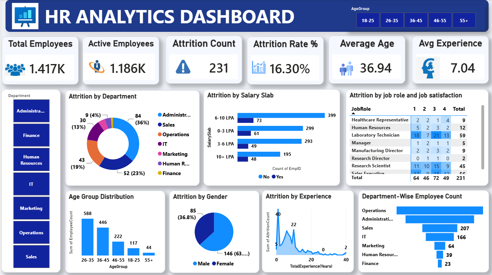

# HR Analytics Dashboard | Power BI

## Project Overview

This project presents an interactive HR Analytics Dashboard developed using Power BI to analyze employee attrition, workforce demographics, job satisfaction, salary distribution, and workforce trends.

The dashboard helps identify key factors influencing employee attrition and supports data-driven HR decision-making.

---

## Objectives

- Analyze employee attrition across departments
- Monitor workforce demographics
- Evaluate attrition by salary, age, experience, and job role
- Track key HR KPIs
- Support business decisions through interactive visualizations

---

## Tools Used

- Power BI
- Power Query
- DAX
- Microsoft Excel

---

## Dashboard Preview

---

## Key KPIs

- Total Employees
- Active Employees
- Attrition Count
- Attrition Rate
- Average Age
- Average Experience

---

## Dashboard Features

- Department Filter
- Age Group Filter
- Attrition Analysis
- Job Satisfaction Matrix
- Salary Analysis
- Experience Analysis
- Department-wise Employee Distribution

---

## Business Insights

- Identified departments with the highest attrition.
- Compared attrition across salary groups.
- Analyzed employee distribution by age group.
- Evaluated job satisfaction across different job roles.
- Monitored workforce composition using interactive visuals.

---

## Skills Demonstrated

- Data Cleaning
- Data Transformation
- DAX Calculations
- Data Visualization
- Dashboard Design
- HR Analytics
- Business Intelligence

---

## Author

Vikash Singh
